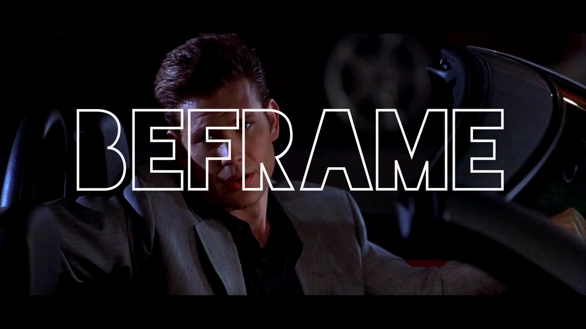

BEFRAME is an AI-powered video project to clip ONLY the scenes in the movie where the character is framed and not speaking. They can just "be" in the frame. Explore the characters and director's choices from Legally Blonde, The Exorcist, Fight Club, Pitch Perfect, Die Hard, Pretty Woman, The Princess Bride, and Requiem For a Dream.

Each movie is first clipped by visual content, and then analyzed for shot type. Only the Medium Close-up (MCU) shots are preserved. Google's speech detection is used to filter out any shots with detected words. Finally, the shots are strung back together in sequence.

This project leverages pre-trained models and an extensive reliance of ffmpeg (version >=4.2.1 recommended!)

## Shot classifier, blog, and model
+ https://rsomani95.github.io/ai-film-1.html
+ https://gitpitch.com/rsnk96/fast-cv/master#/
+ https://www.dropbox.com/s/ixt7oxw8j54aorq/shot-type-classifier.pkl?dl=0

## Scene detection
+ https://github.com/Breakthrough/PySceneDetect

## Google-speech-to-text
https://cloud.google.com/speech-to-text/

